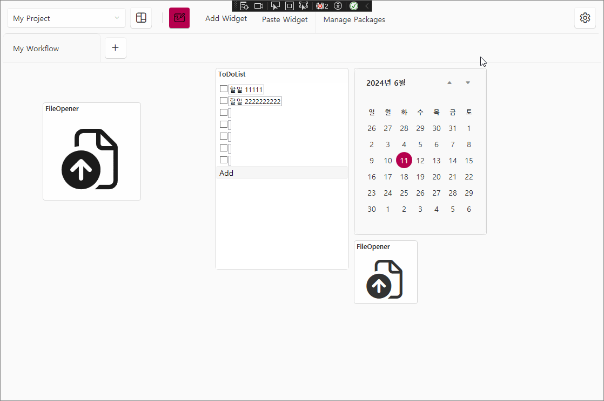

# Corathing  
### Organize Anything with Customizable Widget Dashboards 

Corathing is Customizable Widget Organizer. It is a WPF application that allows you to organize anything with customizable widget dashboards. You can create your own widgets or use the default widgets provided by Corathing.

| Homepage |  Wiki |Readme | Readme |
| --- | --- | --- | --- |
|  [Homepage](https://corathing.com) | [Wiki](https://github.com/dogzz9445/Corathing/wiki/Home) | [English](README.md) | [한국어](README_KR.md) | 



## Inspiration (영감)
- [Freeter](https://github.com/FreeterApp/Freeter) - Freeter is a productivity app that allows you to gather everything in one place.
  - UI/UX 및 기능들에 영감을 얻었습니다.
- [Grafana](https://grafana.com/) - Grafana is the open-source analytics & monitoring solution for every database.
  - 대시보드 모니터링에 영감을 얻었습니다.

✔️ Features
-
- Dashboard host and widget host implementation and bug fixes, testing

❌ Features - TBD
- 

📁 Shared
-
| Name| Folder |Framework | Description | Version
| --- | --- | --- | --- | --- |
| Corathing.Contracts | src/Shared | .Net 8.0 |  | ```진행중```
| Corathing.Contracts.Utils | src/Shared | .Net 8.0 |  | ```진행중```
| Corathing.Dashboards | src/Shared | .Net 8.0 |  | ```진행중```
| Corathing.Dashboards.WPF | src/Shared | WPF |  | ```진행중```
| Corathing.Dashboards.AvaloniaUI | src/Shared | Avalonia |  | ```시작전 Roadmap 3```
| Corathing.UI | src/Shared | .Net 8.0 |  | ```진행중```
| Corathing.UI.WPF | src/Shared | WPF |  | ```진행중```
| Corathing.UI.AvaloniaUI | src/Shared | Avalonia |  | ```시작전 Roadmap 3```


📁 Apps
-
| Name| Folder |Framework | Description | Version
| --- | --- | --- | --- | --- |
| Corathing.Organizer | src/Apps | .Net 8.0 |  | ```진행중```
| Corathing.Organizer.WPF | src/Apps | WPF |  | ```진행중```
| Corathing.Organizer.AvaloniaUI | src/Apps | AvaloniaUI |  | ```시작전 Roadmap 3```
| Corathing.Organizer.AvaloniaUI.Windows | src/Apps | AvaloniaUI |  | ```시작전 Roadmap 3```
| Corathing.Organizer.AvaloniaUI.Mac | src/Apps | AvaloniaUI |  | ```시작전 Roadmap 3```


📁 Widgets
-
| Name| Folder |Framework | Description | Version
| --- | --- | --- | --- | --- |
| [Corathing.Widgets.Basics](src/Widgets/Corathing.Widgets.Basics/README.md) | src/Widgets | WPF |  | ```진행중```
|  |  | WPF |  | ```시작전```

📁 UnitTests
-
| Name| Folder |Framework | Description | Version
| --- | --- | --- | --- | --- |
|  |  | WPF |  | ```시작전```
