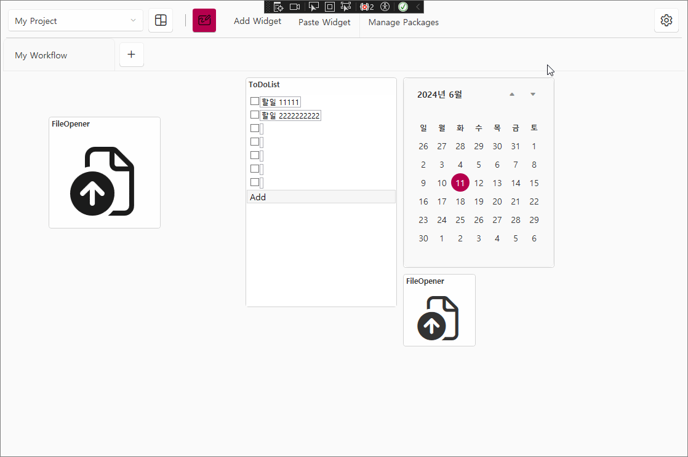

# Corathing 

**Organize Anything with Customizable Widget Dashboards**

Corathing은 위젯을 자유롭게 배치·리사이즈하여 나만의 작업 공간을 꾸밀 수 있는 Windows 데스크탑 애플리케이션입니다. WPF(.NET 10) 기반이며, 위젯과 데이터소스를 DLL/NuGet 플러그인 형태로 동적 로드합니다.

| Homepage | Wiki |
| --- | --- |
| [corathing.com](https://corathing.com) | [GitHub Wiki](https://github.com/dogzz9445/Corathing/wiki/Home) |



---

## 영감 (Inspiration)

- **[Freeter](https://github.com/FreeterApp/Freeter)** — UI/UX 및 작업 공간 조직 방식
- **[Grafana](https://grafana.com/)** — 대시보드/위젯 호스팅 개념

---

## 주요 특징

- 📦 **플러그인 기반 위젯 시스템** — `[EntryCoraWidget]`/`[EntryCoraDataSource]` 속성으로 선언된 어셈블리를 리플렉션으로 자동 발견
- 🧩 **DLL + NuGet 동적 로드** — `IPackageService.LoadDLL` / `LoadNugetFromWebAsync`
- 🎨 **Material Design + MahApps.Metro** 테마, Light/Dark + Windows 11 Mica/Acrylic backdrop
- 🌏 **다국어 지원** — `en_US`, `ko_KR` (어셈블리별 `ResourceManager` 레지스트리 방식)
- 💾 **상태 영속화** — 프로젝트 → 워크플로우 → 위젯/데이터소스 트리를 JSON으로 저장
- ⌨️ **전역 핫키 & 트레이** 지원
- 🔌 **WebView2, 셸 실행, 파일/링크 열기, 타이머, ToDo** 등 기본 위젯 제공

---

## 빠른 시작

### 요구사항

- Windows 10 1903 (빌드 19041) 이상
- [.NET 10 SDK](https://dotnet.microsoft.com/download)
- Visual Studio 2022 17.8+ 또는 Rider (선택)

### 빌드 & 실행

```bash
git clone https://github.com/dogzz9445/Corathing.git
cd Corathing

dotnet restore Corathing.sln
dotnet build Corathing.sln -c Debug

# 메인 앱 실행
dotnet run --project src/Apps/Corathing.Organizer.WPF/Corathing.Organizer.WPF.csproj

# 대시보드 호스트 단독 샘플
dotnet run --project src/Samples/Corathing.Dashboards.WPF.Sample/Corathing.Dashboards.WPF.Sample.csproj
```

### (선택) 서버 개발 시 RSA / JWT 세팅

`Corathing.Organizer.Server` 프로젝트는 현재 스켈레톤이며, WPF 앱 자체 실행에는 **필요하지 않습니다**. 서버를 개발할 때만 아래 단계를 따르세요.

```bash
cd src/Apps/Corathing.Organizer.Server
dotnet user-secrets init
dotnet user-secrets set "Jwt:PublicKey"  "<your-public-key>"
dotnet user-secrets set "Jwt:PrivateKey" "<your-private-key>"
```

RSA 키 생성 참고: <https://cryptotools.net/rsagen>

---

## 프로젝트 구조

```
Corathing/
├─ src/
│  ├─ Shared/          공용 레이어 (Contracts, Dashboards, UI)
│  ├─ Apps/            실행 가능한 애플리케이션 (Organizer + Server/Identity/Database 스켈레톤)
│  ├─ Widgets/         위젯/데이터소스 플러그인 (Corathing.Widgets.Basics)
│  └─ Samples/         단독 실행 데모
├─ docs/               프로젝트 문서 & 로드맵
├─ scripts/            빌드/유틸 스크립트
├─ .github/workflows/  CI/CD (ci.yml, cd.yml)
├─ Corathing.sln
├─ Directory.Build.props
├─ version.json        Nerdbank.GitVersioning
├─ CLAUDE.md           AI 에이전트용 프로젝트 가이드
└─ README.md
```

### Shared (`src/Shared/`)

| 이름 | 타깃 | 설명 |
| --- | --- | --- |
| [Corathing.Contracts](src/Shared/Corathing.Contracts/) | net10.0 | 서비스 인터페이스, 상태 DTO, 플러그인 속성 정의 |
| [Corathing.Contracts.Utils](src/Shared/Corathing.Contracts.Utils/) | net10.0 | 제너레이터, 팩토리, JSON/레이아웃 헬퍼 |
| [Corathing.Dashboards](src/Shared/Corathing.Dashboards/) | net10.0 | UI 중립 대시보드 추상화 |
| [Corathing.Dashboards.WPF](src/Shared/Corathing.Dashboards.WPF/) | net10.0-windows | WPF `DashboardHost`, `WidgetHost`, 드래그/리사이즈 |
| [Corathing.UI](src/Shared/Corathing.UI/) | net10.0 | UI 중립 디자인 시스템 (stub) |
| [Corathing.UI.WPF](src/Shared/Corathing.UI.WPF/) | net10.0-windows | Light/Dark 테마, NotoSansKR 폰트, 스타일 |

### Apps (`src/Apps/`)

| 이름 | 타깃 | 설명 |
| --- | --- | --- |
| [Corathing.Organizer](src/Apps/Corathing.Organizer/) | net10.0 | `PackageService`, `DataSourceService` 등 플랫폼 독립 서비스 |
| [Corathing.Organizer.WPF](src/Apps/Corathing.Organizer.WPF/) | net10.0-windows | **메인 실행 파일** — DI, ViewModel, View, 트레이, 핫키 |
| [Corathing.Organizer.Database](src/Apps/Corathing.Organizer.Database/) | net10.0 | EF Core DbContext (스켈레톤) |
| [Corathing.Organizer.Identity](src/Apps/Corathing.Organizer.Identity/) | net10.0 | JWT 인증 (스켈레톤) |
| [Corathing.Organizer.Server](src/Apps/Corathing.Organizer.Server/) | net10.0 (ASP.NET) | REST/SignalR API (스켈레톤) |

### Widgets (`src/Widgets/`)

| 이름 | 타깃 | 설명 |
| --- | --- | --- |
| [Corathing.Widgets.Basics](src/Widgets/Corathing.Widgets.Basics/) | net10.0-windows | 기본 위젯(Calendar, Commander, Monaco, Note, Opener, Timer, ToDoList, WebPage, WebQuery)과 데이터소스(ExecutableApp, FileStorage, ToDo, WebSession 등) 레퍼런스 구현 |

### Samples (`src/Samples/`)

- [Corathing.Dashboards.WPF.Sample](src/Samples/Corathing.Dashboards.WPF.Sample/) — 대시보드 호스트 단독 데모
- [Corathing.WPF.Sample](src/Samples/Corathing.WPF.Sample/) — 최소 WPF 샘플

> 아키텍처 상세와 위젯/서비스 카탈로그는 [docs/memory/주요요소.md](docs/memory/주요요소.md) 및 [CLAUDE.md](CLAUDE.md) 를 참고하세요.

---

## 위젯/데이터소스 만들기

1. [src/Widgets/Corathing.Widgets.Basics/Widgets/](src/Widgets/Corathing.Widgets.Basics/Widgets/) 혹은 별도 어셈블리에 폴더 생성
2. `WidgetContext` 를 상속한 클래스에 `[EntryCoraWidget(...)]` + 언어별 `[EntryCoraWidgetName(ApplicationLanguage.ko_KR, "열기")]` 속성 부착
3. `XxxOption` (직렬화 POCO) 과 `XxxOptionContext` (`CustomSettingsContext` 상속) 작성
4. `XxxWidget.xaml(.cs)` UI 작성
5. 빌드하면 `PackageService.LoadDLL` 이 리플렉션으로 자동 발견

자세한 예시는 [Widgets/Openers/](src/Widgets/Corathing.Widgets.Basics/Widgets/Openers/) 를 참조하세요. 데이터소스는 같은 패턴으로 `DataSourceContext` + `[EntryCoraDataSource]` 를 사용합니다.

---

## 사용 라이브러리

**MVVM / 구성**
[CommunityToolkit.Mvvm](https://learn.microsoft.com/ko-kr/dotnet/communitytoolkit/mvvm/), [Microsoft.Extensions.DependencyInjection](https://learn.microsoft.com/en-us/dotnet/core/extensions/dependency-injection), [Microsoft.Extensions.Configuration](https://learn.microsoft.com/en-us/dotnet/api/microsoft.extensions.configuration), [Microsoft.Extensions.Localization](https://learn.microsoft.com/en-us/dotnet/core/extensions/localization), [Serilog](https://serilog.net/)

**UI**
[MaterialDesignInXamlToolkit](https://github.com/MaterialDesignInXAML/MaterialDesignInXamlToolkit), [MahApps.Metro](https://github.com/MahApps/MahApps.Metro), [WPF-UI](https://github.com/lepoco/wpfui), [Material.Icons.WPF](https://github.com/SKProCH/Material.Icons), [gong-wpf-dragdrop](https://github.com/punker76/gong-wpf-dragdrop), [Microsoft.Xaml.Behaviors.Wpf](https://github.com/microsoft/XamlBehaviorsWpf), [Microsoft.Web.WebView2](https://learn.microsoft.com/en-us/microsoft-edge/webview2/)

**데이터 / 플러그인**
[Microsoft.EntityFrameworkCore](https://learn.microsoft.com/ko-kr/ef/core/) (Sqlite), [NuGet.Packaging / NuGet.Protocol](https://github.com/NuGet/NuGet.Client), [Usa.Smart.Navigation](https://www.nuget.org/packages/Usa.Smart.Navigation/)

**서버 (스켈레톤)**
[Microsoft.AspNetCore.Authentication.JwtBearer](https://learn.microsoft.com/en-us/aspnet/core/security/authentication/jwt), [SignalR MessagePack](https://learn.microsoft.com/en-us/aspnet/core/signalr/messagepackhubprotocol), [Swashbuckle.AspNetCore](https://github.com/domaindrivendev/Swashbuckle.AspNetCore), [prometheus-net](https://github.com/prometheus-net/prometheus-net)

---

## 로드맵

1.0 → 2.0 → 3.0 단계별 계획은 [docs/roadmap.md](docs/roadmap.md) 에, 세부 할 일은 [docs/todo.md](docs/todo.md) 에 정리되어 있습니다. 주요 미완료 항목:

- 위젯↔위젯 / 데이터소스↔위젯 메시지 전달 (`OnMessage`)
- NavigationService 통합
- Server/Identity/Database 실구현
- 위젯 크기 프리셋 · 배경 · 커스텀 아이콘
- 단위테스트 프로젝트 추가 (`dotnet test` CI 단계)
- WAP/MSIX 스토어 배포 워크플로우 (필요 시 별도 파이프라인)

---

## 기여

`.resx` 편집 방식과 빌드 관련 관습은 [CONTRIBUTE.md](CONTRIBUTE.md) 를 참고하세요. PR 환영입니다.

## 라이선스

MIT — [LICENSE.md](LICENSE.md)
