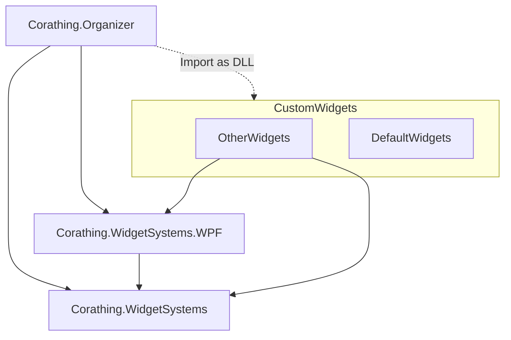

# Corathing
### Organize Anything with Customizable Widget Dashboards

Corathing is Customizable Widget Organizer

[English](README.md)
[한국어](README_KR.md)


카피 프로젝트
- Freeter
- https://github.com/DustinBryant/WpfDashboardControl.git

HW Monitoring
- https://github.com/JettFlat/WPF-hardware-monitor/tree/master
- https://github.com/openhardwaremonitor/openhardwaremonitor
- https://github.com/marcoswada/hwmonitor
- https://github.com/marcoswada/hwmonitor/tree/main/hwmonitor-service
- https://github.com/LibreHardwareMonitor/LibreHardwareMonitor
- https://github.com/ChristianBenner/HardwareMonitor
- https://github.com/chris1111/HWSensors


Corathing 을 사용하기 위해 다음과 같은 지식이 필요합니다.
- MVVM 패턴을 이용한 WPF 프로젝트
- CommunityToolkit 기반 샘플

[Wiki](./wiki/Home.md)

📁 Projects
-
| Name| Folder |Framework | Description | Version
| --- | --- | --- | --- | --- |
| Corathing.Organizer | src/Apps | WPF | Grafana 를 이용한 WPF 모니터링 툴 | ```시작전```
| Corathing.WidgetSystems |  | WPF | KakaoTalk 클론 코딩 | ```시작전```
| Corathing.WidgetSystems.WPF | | ASP.NET | 백그라운드 원격 제어 서버 프로그램 | ```시작전```




📁 Widgets
-
| Name| Folder |Framework | Description | Version
| --- | --- | --- | --- | --- |
| Corathing. | src/Apps | WPF | Grafana 를 이용한 WPF 모니터링 툴 | ```시작전```
| DDTIntraChat |  | WPF | KakaoTalk 클론 코딩 | ```시작전```
| DDTAccessServer | | ASP.NET | 백그라운드 원격 제어 서버 프로그램 | ```시작전```
| DDTAccessManager | | WPF | WPF 원격 제어 클라이언트 프로그램 | ```시작전```
| DDTDeveloperConsoleSample | | WPF | DeveloperConsole 을 만들고  | ```시작전```

📕 library to use
-

| Name (🔗 Core Libraries) | Where to use | Version |
| --- | --- | --- |
| [Microsoft.EntityFrameworkCore](https://learn.microsoft.com/ko-kr/ef/core/) | |
| [Microsoft.Extensions.Logger](https://learn.microsoft.com/en-us/dotnet/core/extensions/logging) | |
| [Microsoft.Extensions.Configuration](https://learn.microsoft.com/en-us/dotnet/api/microsoft.extensions.configuration) | |
| [Microsoft.Extensions.DependencyInjection](https://learn.microsoft.com/en-us/dotnet/core/extensions/dependency-injection) | |
| [Microsoft.Extensions.Localization](https://learn.microsoft.com/en-us/dotnet/core/extensions/localization) | |
| [Microsoft.Xaml.Behaviors.Wpf](https://github.com/microsoft/XamlBehaviorsWpf) | |
| [Microsoft.CommunityToolkit.MVVM](https://learn.microsoft.com/ko-kr/dotnet/communitytoolkit/mvvm/) | |
| [Microsoft.Toolkit.WebView](https://learn.microsoft.com/en-us/windows/communitytoolkit/controls/wpf-winforms/webview) | |

| Name (🔗 Controls and Themes) | Where to use | Version |
| --- | --- | --- |
| [MaterialDesign](https://github.com/MaterialDesignInXAML/MaterialDesignInXamlToolkit) | |
| [MahApp](https://github.com/MahApps/MahApps.Metro) | |
| [WpfUi](https://learn.microsoft.com/en-us/dotnet/api/microsoft.extensions.configuration) | |

### 패키지
- Virtual Serial Port (IO Test용)
- LiveLogViewer (디버그용, 수정해서 사용 중)
- [Prometheus-net MIT] (https://github.com/prometheus-net/prometheus-net)

### 코드 커버리지 및 정적 분석용
- [roslynator.dotnet.cli](https://github.com/dotnet/roslynator)
- [coverlet.collector](https://github.com/coverlet-coverage/coverlet)
- ```dotnet tool install --global CodeQualityToGitlab```

## 개발환경

### Visual Studio Extensions and Tools

- ResxManager: 리소스 관리 및 현지화 기능 제공
- EF Core Power Tools: DB 다이어그램 및 마이그레이션, 리버스 엔지니어링
- roslyn analyzers: 
- SonarLint For Visual Studio 2022: 코드 품질 분석


### VSCode

- Gitlab Workflow
- C# for Visual Studio Code
- C# Extensions
- PowerShell
- DrawIO

# Test Scripts

dotnet tool install roslynator.dotnet.cli --tool-path ./NugetTools
https://www.codecentric.de/wissens-hub/blog/dotnet-ci-cd-with-gitlab
- 'dotnet tool run roslynator  analyze -o ./roslynator.xml --severity-level hidden || true' # run roslynator
    artifacts:
paths:
    - roslynator.xml
    - gl-code-quality-report.json
expose_as: 'code_quality_reports'
reports:
    codequality: gl-code-quality-report.json

### MS Store
- MVVM Toolkit Sample App


# 참고
- https://github.com/dotnet


# 기타 정리 필요

# Workflows

Create CI/CD workflows for WPF and Windows Forms Applications built on .NET 8.x

- [x] CI/CD
- [ ] Code Quality

This repo contains a sample application to demonstrate how to create CI/CD pipelines using [GitHub Actions](https://github.com/features/actions "GitHub Actions page"). 

With GitHub Actions, you can quickly and easily automate your software workflows with CI/CD.
* Integrate code changes directly into GitHub to speed up development cycles
* Trigger builds to quickly identify breaking changes and create testable debug builds
* Continuously run tests to identify and eliminate bugs, improving code quality 
* Automatically build, sign, package and deploy branches that pass CI 

Build, test, and deploy your code entirely within GitHub.

| Workflow | Status |
|----------|--------|
| WPF - CI |  |
| WPF - CD |  |
| WPF - CI (.NET 6 experimental) | [](https://github.com/microsoft/github-actions-for-desktop-apps/actions/workflows/ci-net6-temp.yml) |

