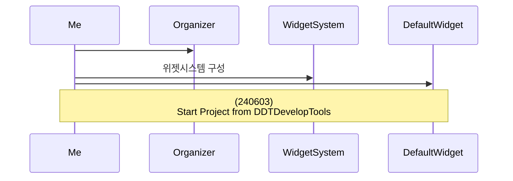

# Progress

```mermaid
sequenceDiagram
    participant me as Me
    participant organizer as Organizer
    participant widgets as WidgetSystem
    participant defaultWidgets as DefaultWidget

    me->>organizer: 
    me->>widgets: 위젯시스템 구성
    me->>defaultWidgets: 
    Note over me,defaultWidgets: (240603)<br/>Start Project from DDTDevelopTools
```

## 240603 Start App

- [x] Corathing 네이밍 및 샘플 로고 제작 
- [ ] 시작
- [x] 시작